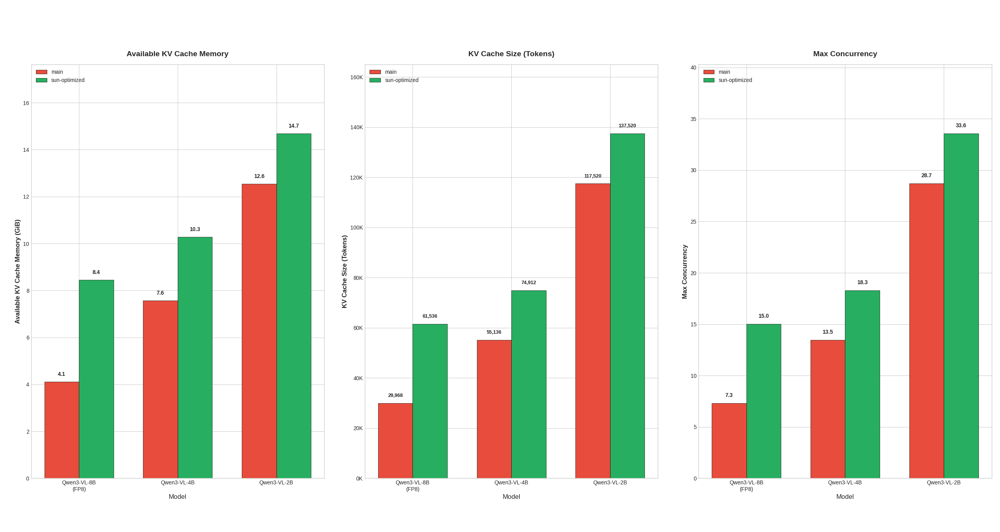
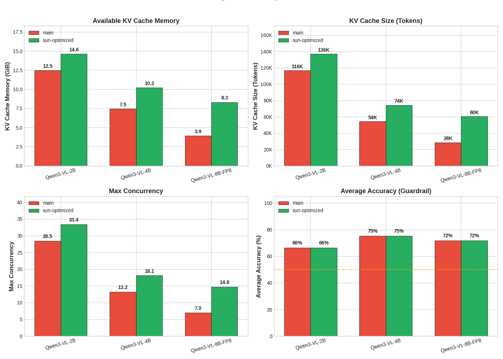
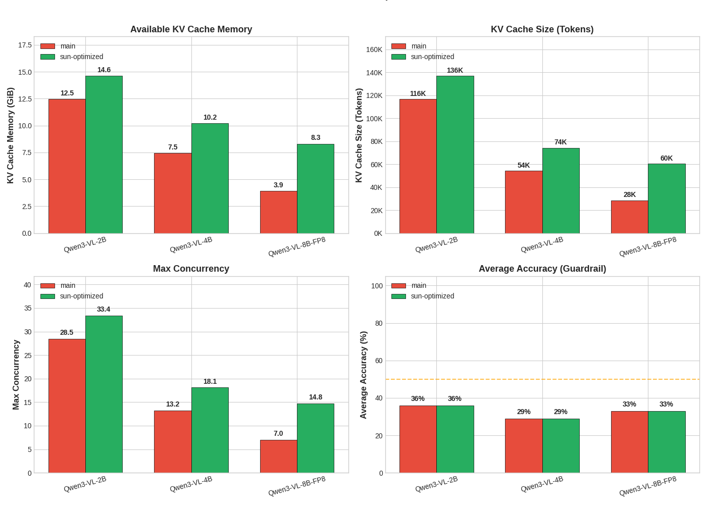
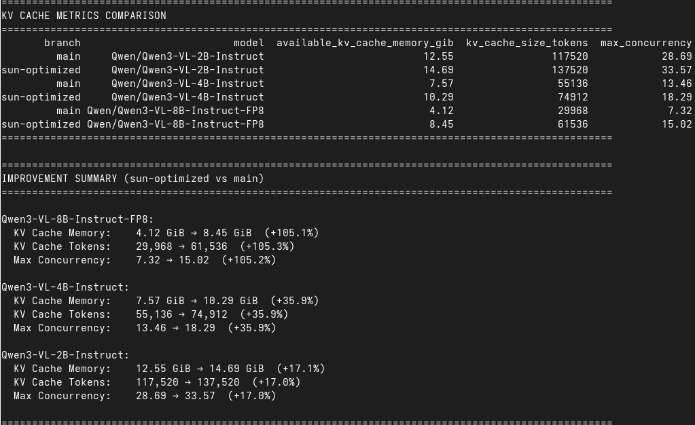
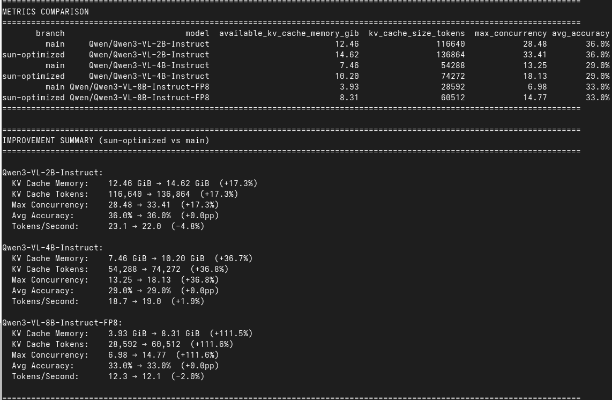

# HPML Project: Encoder Cache Optimization in vLLM

## Team Information
- **Team Name**: vLLM Optimizers
- **Members**:
  - Sun Kim (syk2145)
  - Wen Liang (wl2904)
  - Ryan Sherby (rms2289)
  - Kyle Yang (ky2578)

---

## 🔗 Quick Links

| Resource | Link |
|----------|------|
| **📄 Paper (Overleaf)** | [https://www.overleaf.com/read/nzkngcvpwskr#ce0a1b](https://www.overleaf.com/read/nzkngcvpwskr#ce0a1b) |
| **💻 Optimization Commits** | [https://github.com/sunYtokki/vllm/commits/hpml/final_project](https://github.com/sunYtokki/vllm/commits/hpml/final_project) |
| **📊 WandB Project Board** | [https://wandb.ai/wl2904-columbia-university/vllm-encoder-cache-optimization](https://wandb.ai/wl2904-columbia-university/vllm-encoder-cache-optimization) |
| **✅ Merged PR (Upstream)** | [https://github.com/vllm-project/vllm/commit/f5f51e5](https://github.com/vllm-project/vllm/commit/f5f51e5931ffd99afe69696b60765b88d3eb13f2) |

---

## 1. Problem Statement

Multimodal large language models (LLMs) like Qwen3-VL insert **placeholder tokens** (timestamps, delimiters, padding) into the token sequence, but only a fraction correspond to actual **encoder embeddings**. The baseline vLLM design allocates cache memory for *all* placeholder tokens, leading to severe memory waste.

**Example:** For a Qwen3-VL video input with 100 timestamps:
- **Baseline:** Allocates 1,200 cache slots (12 placeholders × 100 timestamps)
- **Actual embeddings:** Only 100 (one per timestamp)
- **Waste:** 91.7% of encoder cache memory is unused

**Our Goal:** Optimize the encoder cache to store only actual embeddings while maintaining O(1) scheduler queries and preserving model accuracy.

---

## 2. Model Description

### Framework
- **Inference Engine:** [vLLM](https://github.com/vllm-project/vllm) (PyTorch-based)
- **Target Models:** Qwen3-VL family (2B, 4B, 8B parameters)

### Architecture
- **Model Type:** Vision-Language Model (VLM) with encoder-decoder architecture
- **Vision Encoder:** ViT-based image/video encoder
- **Language Model:** Qwen3 decoder with multimodal fusion

### Key Modifications
| Component | Change |
|-----------|--------|
| `PlaceholderRange` | Added `is_embed` boolean mask to identify actual embeddings |
| `EncoderCacheManager` | Cache allocates only for `is_embed=True` positions |
| `Scheduler` | Cumulative sum indexing for O(1) range-to-embedding queries |
| `Profiler` | `get_mm_max_tokens()` returns embedding counts instead of placeholder counts |

---

## 3. Final Results Summary

### Memory Benchmark Results

| Model | Baseline KV Memory | Optimized KV Memory | Improvement |
|-------|-------------------|---------------------|-------------|
| Qwen3-VL-8B-FP8 | 4.12 GiB | 8.45 GiB | **+105.1%** |
| Qwen3-VL-4B | 7.57 GiB | 10.29 GiB | **+35.9%** |
| Qwen3-VL-2B | 12.55 GiB | 14.69 GiB | **+17.0%** |

### Concurrency & Capacity

| Model | Baseline Tokens | Optimized Tokens | Baseline Concurrency | Optimized Concurrency |
|-------|-----------------|------------------|---------------------|----------------------|
| Qwen3-VL-8B-FP8 | 29,968 | 61,536 | 7.32 | **15.02** |
| Qwen3-VL-4B | 55,136 | 74,912 | 13.46 | **18.29** |
| Qwen3-VL-2B | 117,520 | 137,520 | 28.69 | **33.57** |

### Accuracy Preservation (Guardrail Validation)

| Model | Image Accuracy (Baseline) | Image Accuracy (Optimized) | Video Accuracy (Baseline) | Video Accuracy (Optimized) |
|-------|---------------------------|----------------------------|---------------------------|----------------------------|
| Qwen3-VL-8B-FP8 | 71.8% | 71.8% ✓ | 33.0% | 33.0% ✓ |
| Qwen3-VL-4B | 75.3% | 75.3% ✓ | 29.0% | 29.0% ✓ |
| Qwen3-VL-2B | 66.4% | 66.4% ✓ | 36.0% | 36.0% ✓ |

### Summary Metrics

| Metric | Value |
|--------|-------|
| Max Memory Improvement | **+105.1%** (8B model) |
| Max Concurrency Gain | **2.05×** (7.32 → 15.02) |
| Accuracy Degradation | **0.0 pp** (all models) |
| Device | NVIDIA A100 80GB |

---

## 4. Reproducibility Instructions

### A. Requirements

Install dependencies:
```bash
pip install wandb transformers qwen-vl-utils pandas matplotlib seaborn

# For video tests
pip install decord  # Preferred video backend
```

---

### B. WandB Dashboard

View all training and evaluation metrics here:  
**🔗 [WandB Dashboard](https://wandb.ai/wl2904-columbia-university/vllm-encoder-cache-optimization)**

| Group | Description |
|-------|-------------|
| `memory-benchmark` | Memory-only benchmark runs |
| `functional-image` | Image guardrail test runs |
| `functional-video` | Video guardrail test runs |

---

### C. Running Benchmarks (Inference Only)

This project focuses on **inference optimization** (no training involved).

#### Memory Benchmark
```bash
cd test_and_analyze_encoder_cache_optimization

python test_qwen3_wandb_benchmark_test.py \
    --model Qwen/Qwen3-VL-2B-Instruct \
    --branch sun-optimized
```

#### Image Guardrail Test
```bash
python test_qwen3_wandb_image_guardrail_test.py \
    --model Qwen/Qwen3-VL-2B-Instruct \
    --branch sun-optimized \
    --num-images 10
```

#### Video Guardrail Test
```bash
python test_qwen3_wandb_video_guardrail_test.py \
    --model Qwen/Qwen3-VL-4B-Instruct \
    --branch sun-optimized \
    --num-videos 5
```

---

### D. Evaluation / Analysis

Generate comparison plots from WandB data:
```bash
python analyze_wandb_results.py --group memory-benchmark
python analyze_wandb_results.py --group functional-image
python analyze_wandb_results.py --group functional-video
```

**Output:** PNG files with side-by-side comparison charts.

#### Memory Benchmark Results (`kv_cache_comparison_metrics.png`)


#### Image Guardrail Results (`functional_image_comparison.png`)


#### Video Guardrail Results (`functional_video_comparison.png`)


---

### E. Quickstart: Minimum Reproducible Result

To reproduce our reported **+105% memory improvement** on Qwen3-VL-8B-FP8:

```bash
# Step 1: Set up environment
pip install wandb transformers qwen-vl-utils pandas matplotlib seaborn

# Step 2: Navigate to test directory
cd test_and_analyze_encoder_cache_optimization

# Step 3: Run memory benchmark (baseline)
python test_qwen3_wandb_benchmark_test.py \
    --model Qwen/Qwen3-VL-8B-Instruct-FP8 \
    --branch main

# Step 4: Run memory benchmark (optimized)
python test_qwen3_wandb_benchmark_test.py \
    --model Qwen/Qwen3-VL-8B-Instruct-FP8 \
    --branch sun-optimized

# Step 5: Generate comparison plot
python analyze_wandb_results.py --group memory-benchmark
```

**Expected Output:**
- Baseline: 4.12 GiB available KV cache
- Optimized: 8.45 GiB available KV cache
- Improvement: **+105.1%**

### Execution Logs

#### Memory Benchmark Results (`memory_benchmark_cmd.png`)


#### Image Guardrail Results (`functional_image_cmd.png`)


#### Video Guardrail Results (`functional_video_cmd.png`)


---

## 5. Repository Structure

```
vllm/
├── vllm/                                 # Core vLLM source code (modified)
│   ├── multimodal/
│   │   ├── inputs.py                     # PlaceholderRange with is_embed mask
│   │   └── profiling.py                  # get_mm_max_tokens API
│   └── v1/
│       ├── core/
│       │   ├── encoder_cache_manager.py  # Optimized cache allocation
│       │   └── sched/scheduler.py        # Cumulative sum indexing
│       └── worker/
│           └── gpu_model_runner.py       # Sparse mask handling
│
├── test_and_analyze_encoder_cache_optimization/   # Benchmark & Analysis
│   ├── README.md                                  # This file
│   ├── final_report.tex                           # LaTeX paper source
│   ├── analyze_wandb_results.py                   # Analysis & plotting tool
│   ├── test_qwen3_wandb_benchmark_test.py         # Memory benchmark script
│   ├── test_qwen3_wandb_image_guardrail_test.py   # Image guardrail script
│   ├── test_qwen3_wandb_video_guardrail_test.py   # Video guardrail script
│   ├── kv_cache_comparison_metrics.png            # Plot: Memory benchmark results
│   ├── functional_image_comparison.png            # Plot: Image accuracy results
│   ├── functional_video_comparison.png            # Plot: Video accuracy results
│   └── *_cmd.png                                  # Execution log screenshots
│
└── tests/                                # Unit tests
    ├── v1/core/test_encoder_cache_manager.py
    └── multimodal/test_utils.py
```

---

## 6. Key Observations

1. **Memory savings scale with model size:** Larger models have proportionally larger vision encoders, making encoder cache optimization more impactful (+105% for 8B vs +17% for 2B).

2. **Concurrency doubles for the largest model:** The 8B-FP8 model's max concurrency increases from 7.32 to 15.02 requests—a 2× improvement.

3. **Zero quality degradation:** Accuracy remains identical (0.0 pp change) across all models for both image and video inputs.

4. **Production impact:** This optimization has been [merged into upstream vLLM](https://github.com/vllm-project/vllm/commit/f5f51e5931ffd99afe69696b60765b88d3eb13f2).

---

## 7. Contact

- Sun Kim: syk2145@columbia.edu
- Wen Liang: wl2904@columbia.edu
- Ryan Sherby: rms2289@columbia.edu
- Kyle Yang: ky2578@columbia.edu
